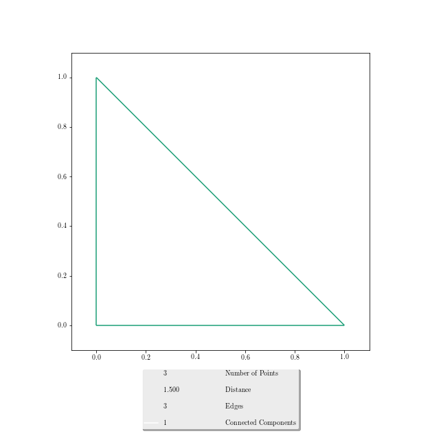

========
Usage
========

To get started, first we need a :class:`~persispy.point_cloud.PointCloud`.::

    >>> import persispy
    >>> import persispy.point_cloud as ppc

    >>> triangle = [(0,0),(0,1),(1,0)]
    >>> print(triangle)
    >>> tri_pc = ppc.PointCloud(triangle)
    >>> print(tri_pc)
    >>> print(tri_pc.get_points())

    [(0, 0), (0, 1), (1, 0)]
    Point cloud with 3 points in real affine space of dimension 2

From here we can construct our weighted neighborhood graph, the :class:`~persispy.weighted_simplicial_complex.wGraph`.::

    >>> tri_ng = tri_pc.neighborhood_graph(epsilon=1.5, method="subdivision")
    >>> print(tri_ng)
    >>> print(tri_ng.adjacencies(pretty=True))
    >>> plot2d(tri_ng, shading_style="component")

   

::

    [point 0: [0, 0], point 1: [0, 1], point 2: [1, 0]]
    Weighted graph with 3 points and 3.0 edges
    {point 0: [0, 0]: {(point 2: [1, 0], 1.0), (point 1: [0, 1], 1.0)},
     point 1: [0, 1]: {(point 0: [0, 0], 1.0),
                       (point 2: [1, 0], 1.4142135623730951)},
     point 2: [1, 0]: {(point 0: [0, 0], 1.0),
                       (point 1: [0, 1], 1.4142135623730951)}}
                       
                       
If we know a process to generate points, we can then pass the list to :class:`~persispy.point_cloud.PointCloud`.::
    
    >>> from random import uniform
    >>> from math import sin, cos

    >>> circle = [ (cos(x), sin(x)) for x in [uniform(0, 2*float(22)/7) for _ in range(50)]]
    >>> circle_pc = ppc.PointCloud(circle)
    >>> circle_ng = circle_pc.neighborhood_graph(.5)
    >>> print(circle_pc)
    >>> print(circle_ng)

    Point cloud with 50 points in real affine space of dimension 2
    Weighted graph with 50 points and 185 edges
    

To visualize what our points look like, we can call the :mod:`persispy.plot` module, which has the :func:`~persispy.plot.plot2d` and :func:`~persispy.plot.plot3d` functions.::

    >>> from persispy import plot
    >>> plot.plot2d(circle_pc)
    >>> plot.plot2d(circle_ng, shading_style='component')
    

           
And the :func:`~persispy.plot.plot3d` function.

           
Last but not least is the persistent homology function. We need to import the :mod:`persispy.persistent_homology` module. The :func:`~persispy.persistent_homology.PersistentHomology` class takes a weighted simplicial complex constructed from the neighborhood graph.:: 

    >>> import persispy.points as pp
    >>> import persispy.weighted_simplicial_complex as wsc
    >>> import persispy.hashing as php
    >>> import persispy.point_cloud as ppc
    >>> import persispy.persistent_homology as pph

    >>> dimension = 4
    >>> epsilon = .2
    >>> points = 150

    >>> point_cloud = pp.sphere(points, .5, 'rejection')
    >>> weighted_graph = point_cloud.neighborhood_graph(epsilon,'subdivision')

    >>> print(weighted_graph)
    >>> print("number of connected components", len(weighted_graph.connected_components()))
    Weighted graph with 150 points and 591 edges
    number of connected components 1

    >>> scl = wsc.sorted_clique_list(weighted_graph)
    >>> wscomplex = wsc.wSimplicialComplex.from_clique_list(weighted_graph,scl._cliques)
    >>> print(wscomplex)
    >>> print(wscomplex.simplices(pretty=True))
    6-dimensional weightedsimplicial complex with 150 vertices and 2257 positive-dimensional simplices
    {0: [Weighted simplex (point 149: [ 0.29795713,  0.02485743,  0.0127191 ],) with weight 0,
     Weighted simplex (point 3: [ 0.32850408, -0.22642129,  0.00613028],) with weight 0,
     Weighted simplex (point 108: [ 0.06551198, -0.18905092, -0.34530435],) with weight 0,
     ...
    Weighted simplex (point 31: [-0.0439985 ,  0.12597624, -0.11507324], point 81: [-0.04286952, -0.00533167, -0.14161685], point 113: [-0.13253569, -0.04752177, -0.09129936], point 126: [-0.18052554,  0.07896343, -0.08906291], point 142: [-0.07950361, -0.00526919, -0.12755901], point 143: [-0.14284519,  0.12515783, -0.11047889], point 145: [-0.13731632,  0.07565652, -0.1644496 ]) with weight 0.196228411851]}

From here, we can call :func:`~persispy.persistent_homology.PersistentHomology` with some guesses at the dimension.:: 

    >>> ph = pph.PersistentHomology(wscomplex,dimension)
    >>> ph.plot_bar_code(dimension, epsilon, thickness=5)
    >>> ph.plot_bar_code(dimension, epsilon, thickness=1, weight=False)

